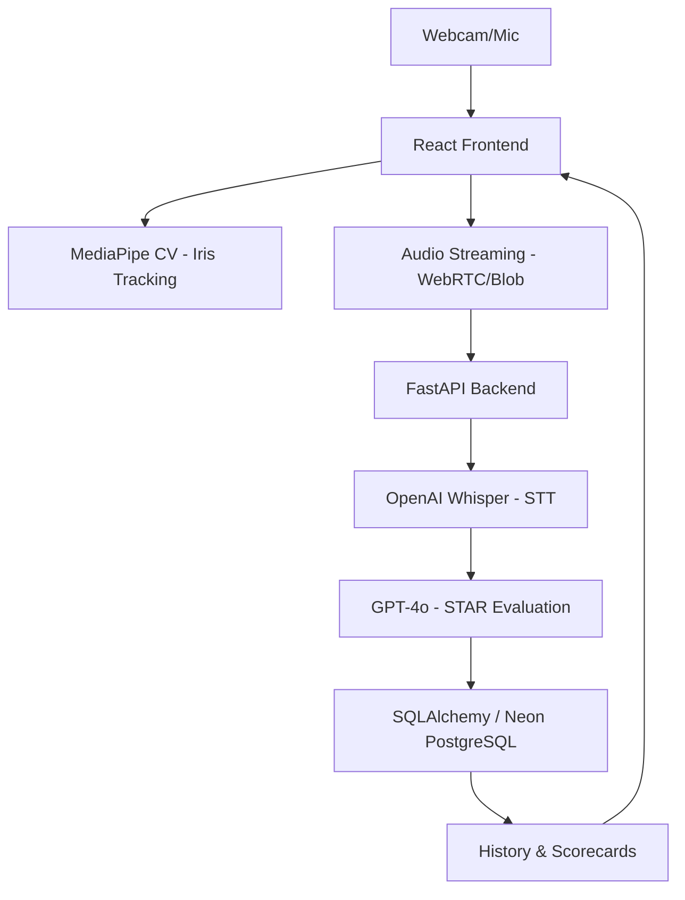

# Project 13: Interview Preparation Chatbot with Real-Time Feedback

## 🎯 Problem Statement
University students and early-career professionals often fail technical interviews not because they lack knowledge, but because they lack **personalized, high-fidelity behavioral feedback**. Traditional mock interviews are hard to schedule and often lack quantitative metrics on confidence, pacing, and eye contact.

## 🚀 Feature List (MVP Scope)
For the MVP, we focus on **Behavioral and System Design** interviews.
- **🎤 Multi-Modal Input**: Captures both video (eye tracking) and audio (verbal answer).
- **👁️ Eye Contact Tracking**: Real-time iris positioning using MediaPipe.
- **🗣️ Verbal Analytics**: Filler word detection and Words Per Minute (WPM) calculation from Whisper transcripts.
- **🧠 STAR Evaluation**: GPT-4o evaluates the structural integrity (Situation, Task, Action, Result) of answers.
- **📊 Interactive Scorecard**: Comprehensive review of communication, technical ability, and confidence.
- **⚠️ Real-Time Cues**: Immediate visual prompts (e.g., "Slow down", "Look at the camera").

## 🏗️ System Architecture

### Responsibility Matrix:
- **Frontend (Browser)**: MediaPipe CV, WebRTC Capture, Real-time UI feedback.
- **Backend (Server)**: Audio chunk processing, LLM evaluation, Data persistence.

## 🗄️ Database Schema (Neon PostgreSQL)
- **Users**: Auth credentials and profiles.
- **Sessions**: Configuration metadata (Role, Company, Difficulty).
- **AnswerLogs**: Transcription, Eye-contact score, WPM, Filler counts.
- **Scorecards**: Overall Grades (A-F) and constructive LLM feedback.

## 👥 Assigned Team Roles
- **Frontend & CV (React/MediaPipe)**: Responsible for UI, Camera/Mic access, and gaze tracking logic.
- **Audio & Backend (FastAPI/Whisper)**: Responsible for async audio processing and server pipelines.
- **LLM Evaluation (GPT-4o)**: Responsible for prompt engineering and score generation logic.

---

### **Note on Privacy & Latency**
- **Latency Optimization**: MediaPipe is executed **client-side** in the browser to ensure zero network latency and lower server costs.
- **Privacy**: We do not store raw video feeds; only anonymous mathematical landmark coordinates are processed.
