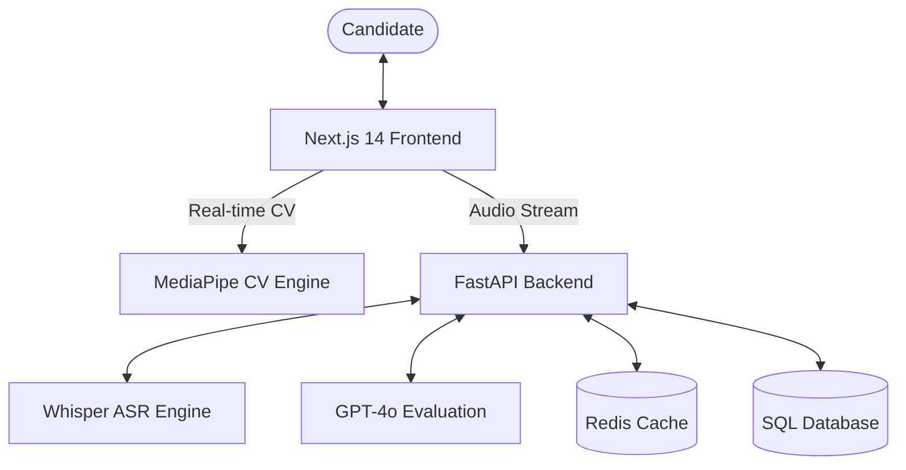
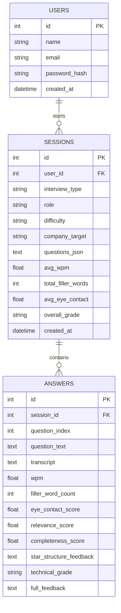

# AI Sandbox: Enterprise AI Interview & Proctoring Platform

A high-performance, production-ready system for automated AI mock interviews, real-time computer vision proctoring, and deep pedagogical analysis of candidate performance.

## 1. System Overview
AI Sandbox provides an end-to-end environment where candidates can practice technical and behavioral interviews. The system simultaneously monitors visual engagement (eye contact), speech analytics (WPM and filler words), and evaluates answer quality using GPT-4o optimized against the STAR framework.

---

## 2. System Architecture



### Component Breakdown
- **Frontend Layer**: Built with Next.js 14, utilizing React Hooks for state management of live media streams and real-time proctoring HUDs.
- **Vision Engine**: Client-side execution of MediaPipe FaceLandmarker to ensure sub-100ms latency for eye-tracking and multi-face detection.
- **Backend API**: A modular FastAPI service orchestrated to handle concurrent audio processing, database transactions, and LLM completions.
- **Analytics Layer**: Specialized Python services for pattern-based filler word detection and word-per-minute (WPM) calculation from transcription metadata.

---

## 3. Database Schema (ER Diagram)



---

## 4. Key Functional Features

### Real-Time Proctoring and Gaze Tracking
The vision system utilizes the 478 landmarks of the MediaPipe FaceLandmarker model.
- **Iris Tracking**: Calculates gaze persistence by tracking iris position relative to the inner and outer eye corners.
- **Multi-face Detection**: Prevents session tampering by identifying multiple skeletal face structures in the frame.
- **Device Usage Detection**: Heuristic-based tracking of head posture and gaze to identify potential mobile device usage or external reading.

### Speech and Audio Analytics
- **Transcription**: High-fidelity conversion of audio to text via OpenAI/Groq Whisper Large-v3.
- **Pacing Analysis**: Calculation of WPM (Words Per Minute) based on transcription word count and audio segment duration.
- **Filler Word Detection**: Pattern matching against a comprehensive library of filler words (e.g., "um", "like", "actually") to evaluate speech clarity.

### Pedagogical LLM Evaluation
The platform leverages GPT-4o to analyze candidate responses against the STAR Framework:
1.  **Situation & Task**: Evaluates if the context was clearly established.
2.  **Action**: Documents the specific steps taken by the candidate.
3.  **Result**: Quantifies or defines the success of the outcome.
4.  **Technical Accuracy**: Factual grading of technical concepts, algorithms, and system design patterns.

---

## 5. Security Protocol & Session Termination
For high-stakes mock interviews, the system enforces a strict Security Protocol:
- **Violation Logging**: Each proctoring breach (e.g., looking away, multi-face) is logged with a timestamp and violation count.
- **Escalation Policy**: Upon reaching the 4th major violation, the session state is locked and marked as "Security Terminated".
- **Finalization**: Terminated sessions are assigned a grade of "N/A" and redirect the user to a security summary report to maintain integrity.

---

## 6. Security and Data Integrity

The AI Sandbox architecture is designed with a "Privacy-First, Integrity-Always" approach:

### Vision Privacy
- **On-Device Processing**: All Computer Vision calculations (MediaPipe FaceLandmarker) occur directly on the candidate's browser. No raw video feed is transmitted to the backend, ensuring zero-latency proctoring and total visual privacy.
- **Skeletal Metadata**: Only extracted metadata (e.g., eye contact percentages) is persisted for the final scorecard.

### Interview Integrity
- **Finalized Session Locking**: Once a session is finalized (either manually or via security termination), the database record is flagged as `is_finalized`. Any subsequent attempts to modify answer logs or scores are rejected by the API layer.
- **Anti-Bypass Mechanisms**: The termination protocol uses performance-based timestamps (`performance.now()`) to ensure the 3-second security checks cannot be bypassed by browser throttling or simulated events.

### API & Secret Management
- **Environment Isolation**: Sensitive credentials (OPENAI_API_KEY, GROQ_API_KEY, DATABASE_URL) are strictly isolated in `.env` files and are never exposed to the client-side bundle.
- **CORS Hardening**: The FastAPI backend implements a strict Cross-Origin Resource Sharing policy to ensure only authorized frontend origins can interact with session data.

---

## 7. Installation and Setup

### Prerequisites
- Node.js 18+ (Bun recommended)
- Python 3.10+
- OpenAI or Groq API Keys

### Backend Execution
```bash
cd interview-backend
python -m venv venv
venv\Scripts\activate
pip install -r requirements.txt
python main.py
```

### Frontend Execution
```bash
cd interview-frontend
bun install
bun run dev
```

---

*© 2026 AI Sandbox - Intelligent Interview Analytics Platform.*
